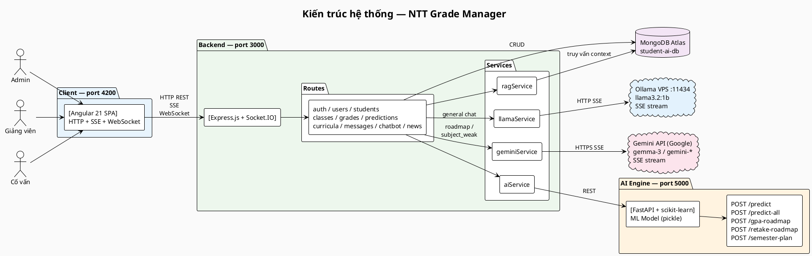
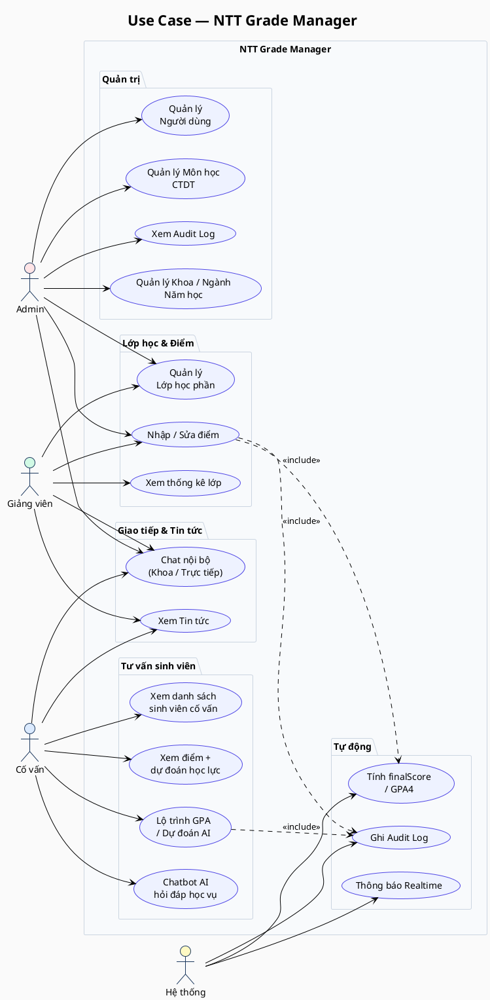
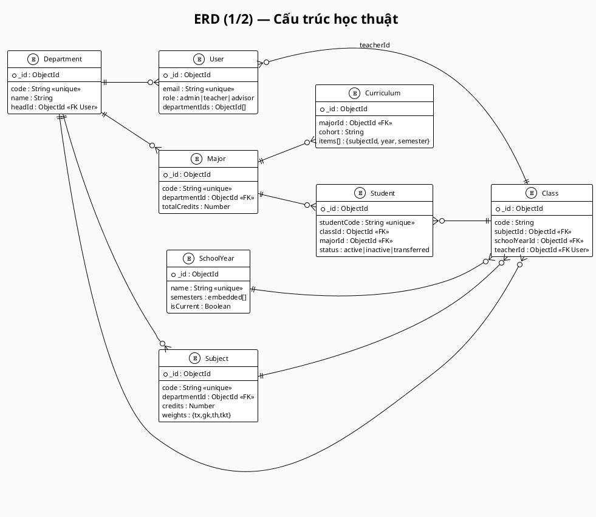
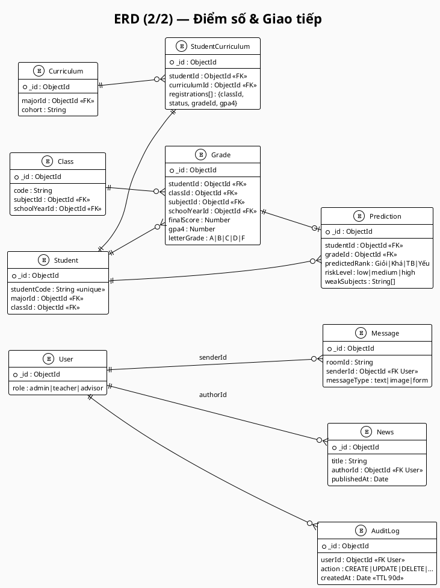
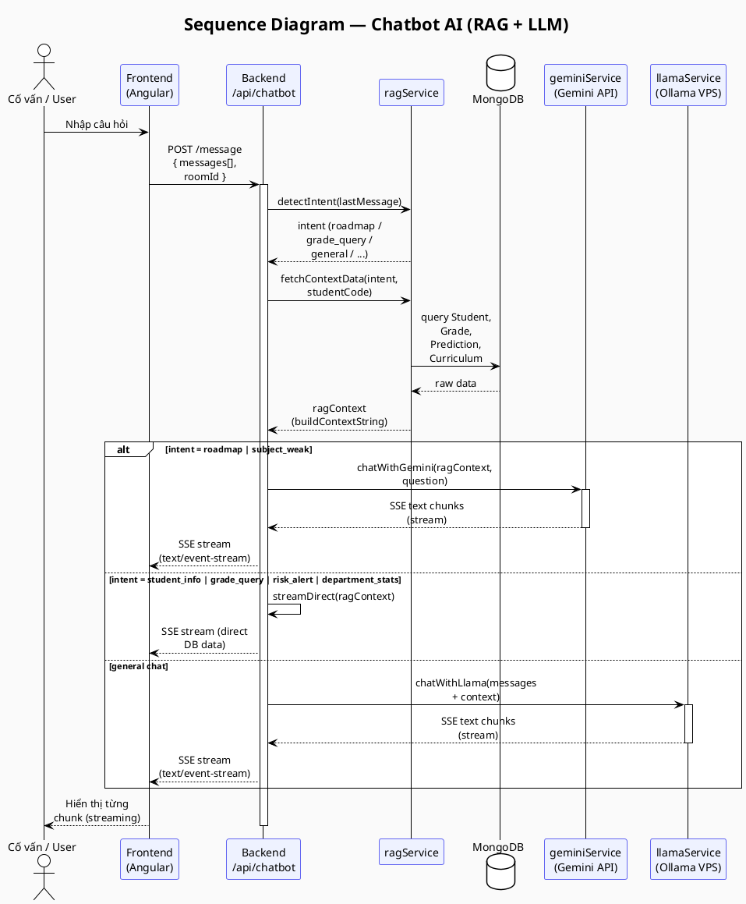
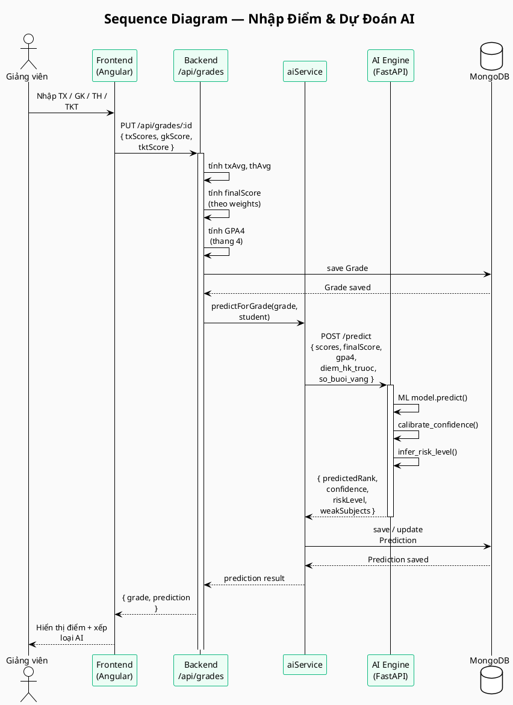
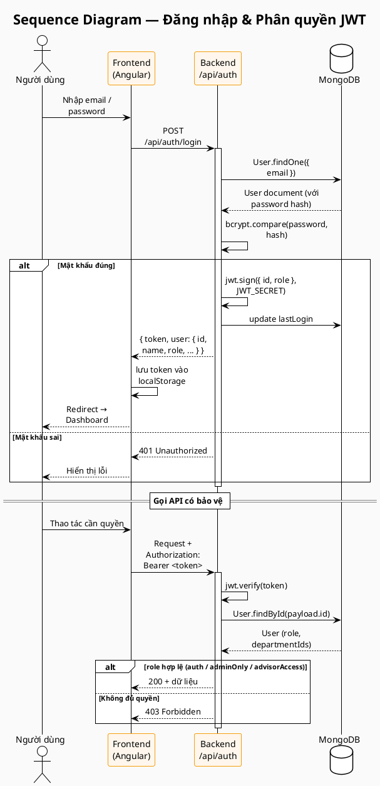

# PlantUML Diagrams — NTT Grade Manager

---

## 1. Kiến trúc hệ thống (System Architecture)

---

## 2. Use Case Diagram

---

## 3. ERD — Phần 1: Cấu trúc học thuật

---

## 4. ERD — Phần 2: Điểm số & Giao tiếp

---

## 5. Sequence — Chatbot AI (RAG + LLM)

---

## 6. Sequence — Nhập Điểm & Dự Đoán AI

---

## 7. Sequence — Đăng nhập & Phân quyền

